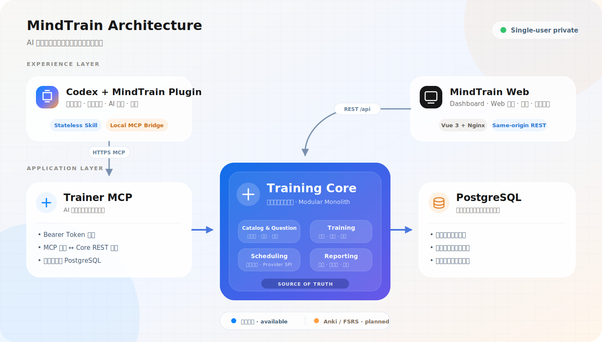
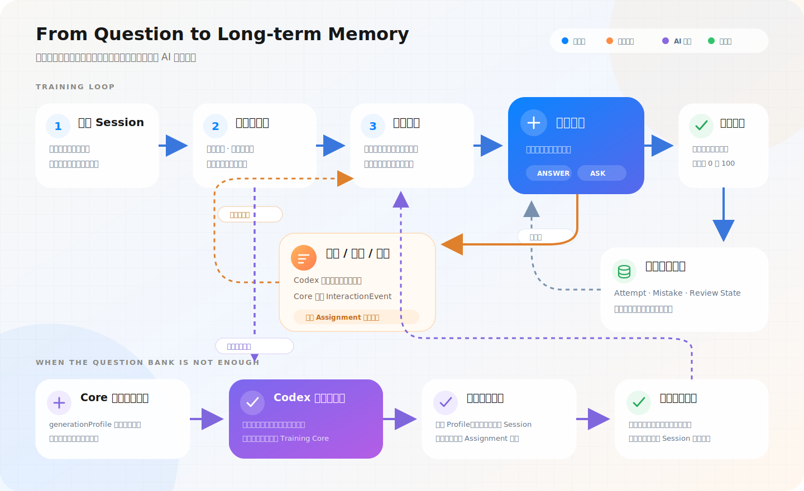
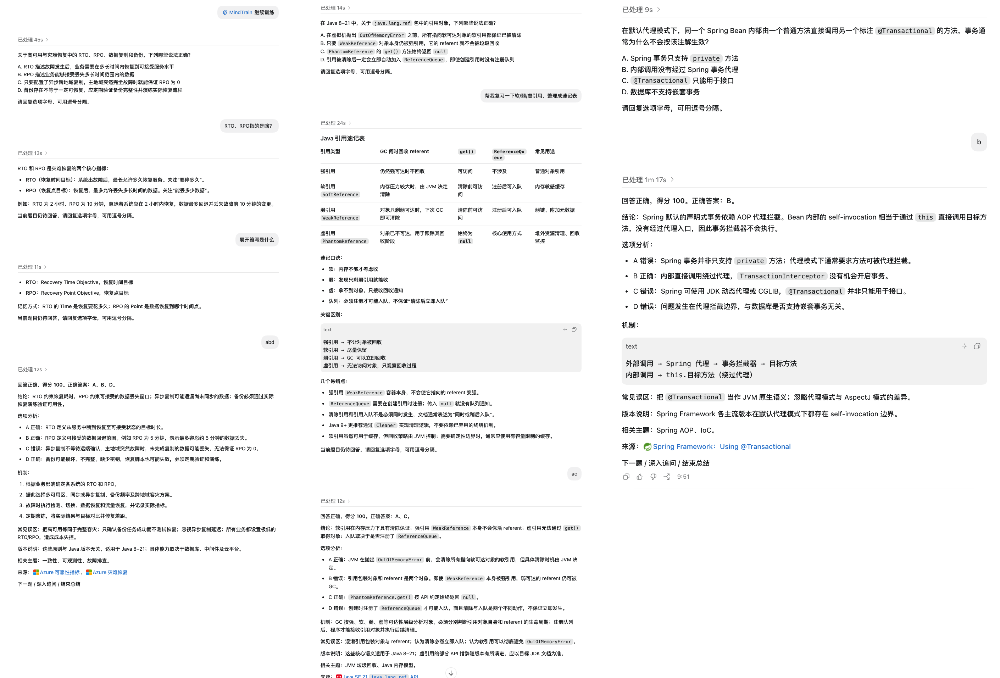

<p align="center">
  
</p>

<h1 align="center">MindTrain</h1>

<p align="center">
  <strong>English</strong> ·
  <a href="README.zh-CN.md">简体中文</a> ·
  <a href="README.zh-TW.md">繁體中文</a>
</p>

<p align="center">
  <strong>Your private AI knowledge gym: ask, practice, and review—turning one conversation into long-term memory.</strong>
</p>

<p align="center">
  <a href="https://mindtrain.jianyutan.com/">Live Demo</a> ·
  <a href="#get-started-in-5-minutes">Quick Start</a> ·
  <a href="doc/CodexPlugin部署.md">Codex Plugin</a> ·
  <a href="doc/部署与运维.md">Deployment</a>
</p>

<p align="center">
  <a href="https://github.com/shigella520/MindTrain/actions/workflows/ci.yml"></a>
  <a href="LICENSE"></a>
  <a href="https://openjdk.org/projects/jdk/21/"></a>
  <a href="https://spring.io/projects/spring-boot"></a>
</p>

MindTrain is an open-source knowledge-training platform for Codex and other AI clients. Learn through a natural conversation: ask follow-up questions, challenge an answer, or request a hint at any time. MindTrain handles the question bank, deterministic grading, learning history, and spaced-review scheduling behind the scenes.

- **Stay in the conversation:** ask about an unfamiliar concept without accidentally submitting the current question.
- **Own your data:** self-host a single-user instance with your question bank and learning history stored in PostgreSQL.
- **Close the learning loop:** review old questions, generate new ones on demand, record mistakes, and control daily new-question and review backlogs.
- **Initialize a knowledge catalog:** plan domains and topics through an AI conversation, or organize a knowledge tree from a local reference directory. Nothing is saved until you preview and confirm it.

MindTrain Core is domain-independent. Each private instance manages its own training domains, knowledge trees, and questions.

## Preview

### How it works



- Training Core is the source of truth for questions, sessions, attempts, review state, and configuration.
- Trainer MCP calls Core APIs and never accesses the database directly.
- The Skill orchestrates teaching and tools but stores no authoritative application data.
- A temporary AI-generated question is validated and persisted before display. It can be rejected and physically deleted before answering; once answered, it becomes a regular review question.

See the [architecture overview](doc/概要设计.md) for design decisions and data boundaries.

### Training flow



A training round is more than revealing an answer. The scheduler first selects due and new questions according to the configured budget. You may ask unlimited follow-up questions before submitting. Core grades only after you explicitly submit an option set and then appends the learning record. If the question bank is insufficient, Core returns a structured generation request; Codex generates a candidate and Core validates and stores it before display.

Round size, review and new-question budgets, backlog pause rules, and temporary-question lifetime are database-backed settings available from the Web admin page.

### Train, ask, and review in Codex



Live demo: [https://mindtrain.jianyutan.com/](https://mindtrain.jianyutan.com/) (public sample statistics are available; training requires your own private instance)

## Why MindTrain

| Capability | What you get |
| --- | --- |
| Conversational AI coach | Ask about a concept, request a hint, or challenge an answer without leaving the current question |
| Deterministic grading | Single- and multiple-choice answers use exact option-set equality instead of model judgment |
| Spaced-review scheduling | Balance due reviews and new questions; automatically pause new material when the backlog is too large |
| AI-generated questions | When coverage is insufficient, Codex generates and validates a question for a selected topic, type, and difficulty |
| Local reference library | Index MD, TXT, PDF, DOCX, and PPTX while keeping source files and the index on your machine |
| Knowledge catalog | Browse and search multiple domains and topic trees from Codex or Web, including coverage and mastery data |
| Private data | Core is the only source of truth; the Skill is stateless and runtime data is not stored in the repository |
| Web + Codex | Use Web for dashboards, review, and configuration; use Codex for the full AI-coach experience |

Available today: Training Core, Trainer MCP, MindTrain Web, Codex Plugin, and weighted scheduling. Anki / FSRS Provider is planned.

## Get started in 5 minutes

### Prerequisites

- Git
- Docker and Docker Compose
- Codex CLI or Codex App for the AI-coach experience

### 1. Install and start MindTrain

```bash
git clone https://github.com/shigella520/MindTrain.git
cd MindTrain/deploy/core-only
cp .env.example .env
```

Edit `.env` and replace at least these two values:

```dotenv
POSTGRES_PASSWORD=replace-with-a-random-database-password
MINDTRAIN_BOOTSTRAP_TOKEN=replace-with-a-long-random-token
```

You can generate a random value with `openssl rand -hex 32`. `MINDTRAIN_BOOTSTRAP_TOKEN` protects both Codex → Trainer MCP and Trainer MCP → Core. Never commit or publish it.

```bash
docker compose up -d --build
docker compose ps
```

After all four containers become healthy, open:

- Web: [http://127.0.0.1:4173](http://127.0.0.1:4173)
- Core health: [http://127.0.0.1:8080/actuator/health](http://127.0.0.1:8080/actuator/health)
- MCP health: [http://127.0.0.1:8787/actuator/health](http://127.0.0.1:8787/actuator/health)

PostgreSQL is not exposed to the host. Core, MCP, and Web listen on `127.0.0.1` by default.

### 2. Configure the Codex Plugin

Install the MindTrain Plugin:

```bash
codex plugin marketplace add shigella520/MindTrain --ref main
codex plugin add mindtrain@mindtrain
```

Create a new Codex task and enter:

```text
$mindtrain configure my MindTrain instance
```

Provide the following when prompted:

1. MCP URL. Use `http://127.0.0.1:8787/mcp` locally, or your own HTTPS URL for a remote instance.
2. The `MINDTRAIN_BOOTSTRAP_TOKEN` from `.env`.

Configuration stays in your local user configuration directory and is never written to this repository. See [Codex Plugin deployment](doc/CodexPlugin部署.md) for installation, upgrades, and troubleshooting.

### 3. Create a training domain

Before the first training session, tell MindTrain what you want to learn. A private instance can contain multiple training domains, and each domain can contain multiple root topic trees.

The simplest path is to let Codex plan a domain from your learning goal:

```text
Use $mindtrain to create a training domain for [my learning goal]. Show me the complete topic tree first and save it only after I confirm.
```

Replace `[my learning goal]` with a concrete goal, for example: “Prepare for a Kubernetes operations interview, focusing on Pods, Deployments, Services, and troubleshooting.” If the goal is missing, MindTrain asks about the subject, scope, and desired depth before producing the tree.

If you already have learning material, point MindTrain at a local directory:

```text
$mindtrain use /path/to/notes to create a backend-notes reference library,
organize training domains and topics, preview them, and save only after I confirm
```

In both flows, Codex first displays the complete domain information and topic tree. MindTrain writes it atomically to Core only after explicit confirmation. For local references, the Plugin creates a private parsing environment and full-text index in its local cache. Core never receives the original files, absolute paths, or local index. The initial PDF implementation extracts text only and does not perform OCR.

After creation, use the Web **Knowledge Catalog** to browse topic trees, search topics, and inspect question coverage and mastery. See [Knowledge Catalog](doc/知识目录.md) for details.

### 4. Start your first training session

Create a new task and enter:

```text
$mindtrain start training
```

If your instance has one training domain, MindTrain selects it automatically. If it has multiple domains, Codex or Web requires you to choose one, for example: `$mindtrain start training in ai-agent`. A session draws questions from exactly one selected domain and never mixes domains randomly.

During any question, you can say:

```text
What exactly does this concept mean?
Why is B incorrect?
Give me a hint without revealing the answer.
This question does not fit the topic. Give me another one.
```

An Attempt is created only when you explicitly submit an option set. Follow-up questions do not consume the current question.

## Private cloud deployment

MindTrain targets private, single-user deployments. We recommend exposing only Web and Trainer MCP through a reverse proxy:

```text
https://mindtrain.example.com/     -> http://127.0.0.1:4173/
https://mindtrain.example.com/mcp -> http://127.0.0.1:8787/mcp
```

A remotely exposed MCP endpoint must use HTTPS and a Bearer Token. Never expose PostgreSQL; Core does not need a public port either.

See [Deployment and operations](doc/部署与运维.md) for Nginx, Caddy, Cloudflare Tunnel, health checks, backup and restore, upgrades, and full configuration.

## Upgrade MindTrain

Upgrade the server and Codex Plugin separately. Back up PostgreSQL first: training domains, questions, attempts, and application settings live in the database and must not depend on container storage.

### 1. Back up the database

From `deploy/core-only`:

```bash
mkdir -p ../../backup
docker compose exec -T postgres \
  sh -c 'pg_dump -U "$POSTGRES_USER" -d "$POSTGRES_DB" -Fc' \
  > ../../backup/mindtrain.dump
```

Also store `.env` in a password manager or another controlled location. Do not commit it.

### 2. Upgrade the server

For a source-based deployment:

```bash
cd MindTrain
git pull --ff-only
cd deploy/core-only
docker compose up -d --build
docker compose ps
```

If your Compose file uses `ghcr.io/shigella520/mindtrain-*:latest` images:

```bash
docker compose pull
docker compose up -d --remove-orphans
docker compose ps
```

`latest` is the stable build from `main`; `dev` is for testing any feature branch and should not be the long-term upgrade channel for a production instance. Flyway migrates the database when Training Core starts. If migration fails, preserve the logs and roll back to the previous version; do not edit the Flyway history table manually.

### 3. Upgrade the Codex Plugin

```bash
codex plugin marketplace upgrade mindtrain
codex plugin add mindtrain@mindtrain
```

After upgrading, create a new Codex task so the new Skill and MCP bridge are loaded. Your instance URL and token are stored outside the Plugin and are not lost during an upgrade.

MindTrain validates Plugin, Trainer MCP, and API contract versions when a task starts and during remote tool calls. A compatible mismatch produces an upgrade reminder; an incompatible mismatch stops training and identifies whether the Plugin, server, or both must be upgraded. Do not bypass this check. Always create a new Codex task after upgrading the Plugin.

After the upgrade, verify that Core, MCP, and Web are all `healthy` before training. See [Deployment and operations](doc/部署与运维.md) for backup, restore, rollback, and troubleshooting, and [Codex Plugin deployment](doc/CodexPlugin部署.md) for Plugin details.

## Common operations

```bash
# Inspect status and logs
cd deploy/core-only
docker compose ps
docker compose logs -f trainer-core trainer-mcp web

# Stop services without deleting data
docker compose down
```

Training round size, new-question budget, backlog limits, temporary-question lifetime, and reporting time zone can be changed from **Admin → Training Settings** without restarting services.

## Documentation

| Goal | Read |
| --- | --- |
| Deploy to a server, configure a reverse proxy, back up, or upgrade | [Deployment and operations](doc/部署与运维.md) |
| Install, switch branches, update, or troubleshoot the Codex Plugin | [Codex Plugin deployment](doc/CodexPlugin部署.md) |
| Develop locally, run tests, build images, or understand CI | [Development guide](doc/开发指南.md) |
| Maintain versions or publish a formal release | [Version and release policy](doc/版本与发布规范.md) |
| Understand the Dashboard, Web training, and visual design | [Web design](doc/Web设计.md) |
| Create and query domains and topic trees | [Knowledge Catalog](doc/知识目录.md) |
| Read the REST API | [Training Core OpenAPI](contracts/openapi/trainer-core.yaml) |
| Read product goals, architecture, and repository boundaries | [Product requirements](doc/目标需求.md) · [Architecture](doc/概要设计.md) · [Repository structure](doc/仓库目录规划.md) |
| Read the Skill workflow | [MindTrain Plugin Skill](plugins/mindtrain/skills/mindtrain/SKILL.md) |

## Roadmap

- Expand domain-independent Knowledge Packs and content-management capabilities.
- Improve Web question governance, recent sessions, and training insights.
- Add Anki Bridge and an FSRS Scheduler Provider.
- Add backup and restore, import and export, and multi-user support.

Issues are welcome for usage feedback, question-quality reports, and suggestions for new knowledge domains.

## License

MindTrain is open source under the [MIT License](LICENSE). You may use, modify, distribute, and commercialize it while retaining the original copyright notice and license text.

## Friends

<p align="center">
  <a href="https://linux.do" target="_blank">
    
  </a>
</p>
