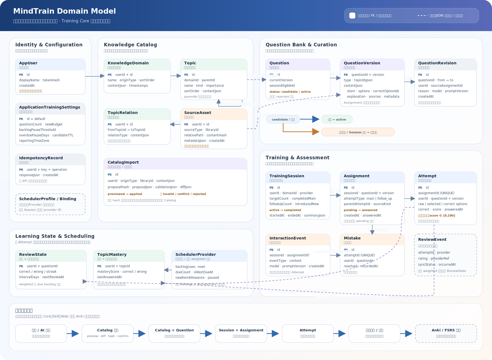

# MindTrain 概要设计

## 1. 文档信息

| 项目 | 内容 |
| --- | --- |
| 项目名称 | MindTrain |
| 文档类型 | 概要设计 |
| 当前版本 | 0.4 |
| 当前阶段 | Core、MCP、Web 与 Codex Plugin 已可部署使用 |
| 领域边界 | 平台核心不绑定具体知识领域 |

目标需求见 [目标需求](目标需求.md)。

## 2. 背景与转型

项目最初以 `java-interview-coach` Codex Skill 验证选择题训练闭环，已经实现了结构化题库、确定性判分、会话记录、掌握度、AI 临时题生成和持续追问。

第一轮真实使用证明了 AI 对话式训练的核心价值：用户不需要离开当前对话，就能在答题过程中随时询问概念、质疑答案、要求举例或继续深入。与此同时，原型也暴露出三个架构限制：

- 算法、Skill、题库和个人学习数据耦合在同一仓库。
- JSON/JSONL 文件不适合作为可共享应用的生产数据源。
- 固定复习间隔无法满足长期抗遗忘，也无法方便接入 Anki/FSRS。

MindTrain 因此转型为通用知识训练平台。Codex Skill 仍是重要入口，但不再是系统本体；Java 面试内容成为首个领域知识包，而不是平台边界。

## 3. 设计原则

1. **Core 是权威数据源**：题库、用户、训练、审核和事件全部由 Training Core 管理。
2. **Skill 无状态**：Skill 只描述 AI 教练工作流，通过 MCP/API 使用应用能力。
3. **调度可插拔**：默认算法和 Anki 通过统一 Scheduler SPI 接入。
4. **Anki 是投影**：Anki 保存调度所需副本及 FSRS 状态，不拥有 MindTrain 题库。
5. **确定性优先**：判分、版本、幂等、状态流转和调度更新由代码控制。
6. **AI 受控**：AI 生成临时题和解释，但不能绕过校验直接修改核心数据；临时题仅在作答后转为普通可复习题。
7. **容量可管理**：新题引入必须服从每日训练预算和未来复习负担。
8. **领域可替换**：核心模型不绑定 Java，领域内容通过 Knowledge Pack 装载。

## 4. 总体架构

```text
┌─────────────────────────────────────────────────────────────┐
│                         交互入口                              │
│  Codex + Skill        Web App        未来其他 AI/客户端       │
└───────────────┬───────────┬───────────────────┬─────────────┘
                │           │ REST              │
                ▼           │                   │
┌───────────────────────┐   │                   │
│     Trainer MCP       │   │                   │
│ 工具封装 / 错误恢复    │   │                   │
└───────────┬───────────┘   │                   │
            │ HTTPS API     │                   │
┌───────────▼───────────────▼───────────────────▼─────────────┐
│                         Training Core                        │
│ 知识资产 │ 内容治理 │ 训练会话 │ 判分 │ 报告 │ 默认调度 │ 插件管理 │
└───────────────┬───────────────────────────────┬─────────────┘
                │                               │
                ▼                               │ 同步/事件
         ┌──────────────┐                       ▼
         │ PostgreSQL   │             ┌──────────────────────┐
         │ Object Store │             │ Trainer Anki Bridge  │
         └──────────────┘             │ 本地 MCP / Add-on    │
                                      └──────────┬───────────┘
                                                 ▼
                                      ┌──────────────────────┐
                                      │ Anki Scheduler/FSRS  │
                                      │ Collection / Revlog  │
                                      └──────────┬───────────┘
                                                 ▼
                                      AnkiWeb / 私有 Sync Server
```

## 5. 组件职责

### 5.1 Training Core

工作名为 `trainer-core`，采用模块化单体，提供 REST API，并作为所有业务数据的权威来源。

核心模块：

| 模块 | 职责 |
| --- | --- |
| Identity | 用户、实例、权限和访问令牌 |
| Catalog | 领域、知识点、关系、来源和知识包 |
| Question Bank | 题目、版本、选项、解释和状态 |
| Curation | AI 临时题校验、未作答拒绝清理和已作答题版本修订 |
| Training | Session、Assignment、Attempt、Mistake 和交互记录 |
| Assessment | 答案解析、确定性评分和结构化反馈数据 |
| Scheduling | Scheduler SPI、默认加权调度和容量策略 |
| Integration | 插件注册、Anki 映射、Outbox/Inbox 和同步状态 |
| Reporting | 掌握度、覆盖率、积压、正确率和阶段报告 |
| AI Workflow | Prompt 版本、生成任务、模型调用记录和评测 |

Core 首期使用 Spring Boot + PostgreSQL。媒体和大型导入包可使用兼容 S3 的对象存储；首版可以先使用本地对象存储卷。

### 5.2 Trainer MCP

工作名为 `trainer-mcp`，是 Codex 等 MCP 客户端的工具入口。

主要职责：

- 把 Core API 转换为语义明确的 MCP 工具。
- 统一暴露创建会话、获取下一题、记录答案、追问和总结等操作。
- 根据 Session 的 Scheduler Provider 路由到默认调度或本地 Anki Bridge。
- 隐藏 API 鉴权、幂等键、重试和分页细节。
- 只返回展示所需字段，避免提前泄露正确答案。

建议首期 MCP 工具：

```text
create_training_session
get_next_assignment
submit_choice_answer
record_interaction
finish_training_session
get_learning_report
create_candidate_question
reject_generated_question
get_scheduler_backlog
list_knowledge_domains
get_knowledge_catalog_tree
search_knowledge_topics
get_knowledge_topic
preview_training_domain
get_training_domain_draft
confirm_training_domain
discard_training_domain_draft
sync_scheduler_plugin
```

### 5.3 MindTrain Skill

Skill 名称为 `mindtrain`，与项目和 Plugin 名称保持一致，作为 AI 教练行为层：

- 规定何时调用 Trainer MCP。
- 控制题目展示、答案解析失败重试和解释顺序。
- 允许用户在正式答案前后自由追问。
- 把 AI 生成题保存到 Core，而不是写入仓库。
- 不直接读写 PostgreSQL、Anki Collection 或仓库数据文件。
- 题目提示使用中性文案，不提供可能泄露答案数量的示例组合。
- 在 Codex 主机本地配置、抽取和索引命名资料库；原文、抽取文本及绝对路径不上传 Core。
- Codex 可根据 AI 对话目标或用户选择的本地资料整理训练领域、知识点层级与关系；用户完整预览并一次确认后保存到 Core。Core 不替用户决定学习内容。
- 开始训练前先解析领域：零个领域时引导初始化，一个领域时自动选择，多个领域时要求用户明确选择。Session、Question、Candidate 和 Scheduler 查询共享同一领域边界，一次 Session 不跨领域出题。

### 5.3.1 Codex Plugin 与首次配置

MindTrain 通过仓库级 Codex Marketplace 分发 Plugin。Plugin 包含领域无关 Skill 和本地 MCP bridge，但不写死任何用户的私有实例地址或 Token。

安装流程为：添加 Git Marketplace 来源、安装 `mindtrain@mindtrain`、开启新任务、首次调用 Skill 配置私有 Trainer MCP URL 和单用户 Bootstrap Token。Bridge 校验远程 MCP 身份与 Token 后，把配置保存到用户配置目录，并以用户私有文件权限保护；仓库、Plugin 包和学习数据中均不保存凭据。

Trainer MCP 对 `/mcp` 强制验证 Bearer Token。单用户私有部署沿用 Bootstrap Token，不引入 OAuth 和多租户认证；Core 和 PostgreSQL 不直接暴露公网。

Plugin Bridge 和 Trainer MCP 使用双向兼容性握手。Bridge 的 `initialize` 携带 Plugin 组件版本，并在所有远程请求头中携带 Plugin 版本与契约版本；Trainer MCP 返回服务端组件版本、契约版本和最低兼容 Plugin 版本。组件版本不同但契约仍兼容时返回升级提醒；契约不匹配、Plugin 低于最低版本或旧服务端没有兼容元数据时阻断远程工具调用。`get_mindtrain_configuration` 会执行实时检查，Trainer MCP 也会在每次 `tools/call` 前校验，因此服务端升级后，已经配置过的旧 Plugin 也不能静默绕过检查。

### 5.4 Scheduler SPI

所有调度器实现统一能力：

```text
health
get_backlog
plan_session
introduce_items
next_item
record_review
get_item_state
```

通用输入包括用户、范围、训练预算、时间和 Review Event；通用输出包括排序后的学习项、到期信息和 Provider 引用。Provider 专有数据放入独立 Binding/State，不污染 Question 和 Attempt 主模型。

首期实现：

- 加权调度（provider ID：`weighted`）：Core 内置默认调度方式。
- `anki`：由本地 Trainer Anki Bridge 提供。

### 5.5 Trainer Anki Bridge

Anki Bridge 是运行在 Anki Desktop 中的 Add-on，并提供受限的本地 MCP/HTTP 接口。

职责：

- 从 Core 获取获准进入 Anki 的 Question Snapshot。
- 按稳定 External Question ID 创建或更新 Note/Card。
- 通过 Anki 的真实 Scheduler 顺序获取下一张卡。
- 向 Scheduler 提交 Again、Hard、Good、Easy。
- 将 Card 映射、Review Event 和同步游标回传 Core。
- 查询 FSRS 状态、Due Backlog 和插件健康状态。

Bridge 不负责：

- 修订已作答普通题并保留历史版本。
- 决定共享题库内容。
- 保存完整 AI 对话。
- 代替 Training Core 管理用户和 Session。

第三方 `ankimcp/anki-mcp-server-addon` 可用于 PoC，但产品实现必须通过自有 Adapter 隔离其 API 和许可证影响。

### 5.6 MindTrain Web

Web 使用 Vue 3、TypeScript、Vite、Vue Router 和 Pinia，只调用 Core REST API。

当前实现包含：

- 学习 Dashboard：今日训练进度、已复习与新题数量、到期积压、准确率、Scheduler 实时状态、带样本门槛的待加强/擅长双榜和内容资产概览。
- Web 训练：创建 Session、获取安全 Assignment、提交单选/多选答案并展示结构化解释。
- 知识目录：经过认证的领域列表、多根知识点树、搜索和节点详情；第一版只读，初始化由 Codex 完成。
- 管理页：训练策略配置、生效/已学习/未学习题目与待答 AI 临时题数量、知识掌握分类和服务状态。
- 实例设置：为单用户私有部署保存 Core 地址和 Bootstrap Token。

同源部署由 Web Nginx 将 `/api/*` 转发到容器网络中的 Core。Web 不直接访问 PostgreSQL，也不承担 AI 临时题生成；当 Core 返回 `generation_required` 时，引导用户使用 Codex 中的 MindTrain Skill。

## 6. 数据架构

### 6.1 代码与数据分离

代码仓库保存：

- Core、MCP、Web、Add-on 和 Skill 源码。
- 数据库迁移、API Schema 和插件协议。
- Docker/部署文件。
- 不含私人信息的最小测试 Fixture。

Training Core 实例保存：

- 所有知识资产和生产题库。
- 所有用户数据、训练历史和调度记录。
- 所有 AI 临时题、Prompt、来源和生成校验记录。

早期 Java 原型资产已经完成迁移并从仓库退役。仓库测试使用测试代码内的匿名 Fixture，不维护可被误认为生产题库的 JSON/JSONL 数据目录。

### 6.2 核心实体

下图展示当前落库实体、逻辑关联、规划扩展和关键状态流转：



```text
KnowledgeDomain
 └─ Topic
     ├─ TopicRelation
     └─ Question
         ├─ QuestionVersion
         ├─ Option
         ├─ Explanation
         └─ SourceReference

User
 └─ TrainingSession
     └─ Assignment
         ├─ Attempt
         ├─ InteractionEvent
         └─ ReviewEvent

SchedulerProfile
 ├─ SchedulerBinding
 ├─ SchedulerState
 └─ PluginSyncEvent
```

Question 只保留两种核心内容状态：`candidate` 表示当前 Session 尚未作答的 AI 临时题，`active` 表示可跨 Session 调度的普通题。临时题作答后原地转为 `active`；用户在作答前拒绝时，相关 Assignment、QuestionVersion 和 Question 被物理删除，不保留 `rejected` 状态。

### 6.3 Anki 投影模型

建议 Anki Note Type 包含：

```text
MindTrainId
QuestionVersion
ProjectionVersion
QuestionType
TopicIds
Stem
OptionsJson
CorrectOptionIds
ExplanationJson
SourcesJson
```

同一记忆单元必须保持稳定 Card ID。普通文字修订只更新 Note；如果正确答案或考查语义发生实质变化，则由 Core 决定创建新的记忆单元并保留旧 Review 历史。

## 7. 关键业务流程

### 7.1 默认训练流程

```text
创建 Session 和预算
    ↓
默认调度器计算复习与新题配额
    ↓
Core 创建 Assignment；缺题时返回 generationProfile
    ↓
Skill 展示题干和 A-D，或按指定题型、难度和知识点生成 AI 临时题
    ↓
用户回答或自由追问
    ↓
Core 解析并精确判分
    ↓
追加 Attempt / Mistake / Review Event
    ↓
调度器更新状态
    ↓
继续或完成报告
```

`generationProfile` 由 Core 生成，至少包含 `questionType`、`difficulty` 和 `knowledgePoint`。Core 根据当前 Session 已出题型的数量选择较少的一类，根据知识点掌握度校准难度；主问题 AI 临时题提交时必须匹配该 Profile。Skill 负责题面质量与来源核验，不能自行改变 Profile。

### 7.1.1 初始化训练领域

领域初始化支持 AI 对话和本地资料两种来源，两者统一经过不可变草案、完整预览、一次确认和事务性保存。一个草案只针对一个新领域或已有领域，但可包含多个根 Topic。AI 对话未绑定来源时返回明确警告；本地资料原文始终留在 Codex 主机。完整边界见 [知识目录](知识目录.md)。

### 7.1.2 从本地资料创建训练领域并出题

```text
用户命名本地资料目录
    ↓
Plugin 在本机私有 venv 中抽取 MD/TXT/PDF/DOCX/PPTX
    ↓
SQLite FTS5 增量索引（原文不上传）
    ↓
Codex 按用户选择的资料整理 Domain / Topic / Relation / Source 元数据草案
    ↓
Core preview 校验并返回 proposalHash、差异和冲突
    ↓
Codex 展示完整预览，用户一次确认保存并启用
    ↓
Core 事务性 apply 正式 Catalog
    ↓
generation_required 时检索本地片段并生成可追溯候选题
```

本地来源使用 `mindtrain-local://<libraryId>/<relativePath>`，并携带内容哈希和定位信息。文件内容变化会形成新的来源版本；历史题目继续引用原哈希。PDF 首期不做 OCR。资料不足时，Skill 每题询问是否允许权威外部来源补充。

### 7.2 Anki 调度流程

```text
Session 选择 scheduler=anki
    ↓
Bridge 同步 Anki 并读取真实 Scheduler Backlog
    ↓
Core 根据预算计算允许引入的新题数量
    ↓
Bridge 返回下一张到期 Card 的 MindTrainId
    ↓
Core 返回当前有效 Question Version
    ↓
Skill 展示、判分和解释
    ↓
Core 保存 Attempt，状态 scheduler_pending
    ↓
Bridge 使用 attemptId 幂等提交 Anki Rating
    ↓
Anki 更新 FSRS，Bridge 回传 Review Event
    ↓
Core 标记 scheduler_synced
```

默认评级建议：

| 记忆表现 | Anki Rating |
| --- | --- |
| 答错或未回忆起 | Again |
| 正确但需要明显提示 | Hard |
| 独立正确 | Good |
| 用户确认非常轻松 | Easy |

### 7.3 AI 临时题流程

```text
发现覆盖缺口
    ↓
AI 按领域、难度和来源要求生成临时题
    ↓
Core 进行结构校验、来源校验和重复检测
    ↓
保存临时题和待答 Assignment
    ↓
用户拒绝 ─→ 物理删除题目与 Assignment，恢复额度，生成替代题
    ↓ 用户作答
转为可跨 Session 调度的普通题并写入复习状态
```

### 7.4 每日容量控制

默认单次预算为 10：

- 训练策略保存在 `application_training_settings`；默认每轮 10 题、新题 2 题，复习题数派生为 `questionCount - newBudget`。
- 新建 Session 固定读取应用级 `questionCount`，API 不再允许临时覆盖题量。
- 积压阈值、严重逾期天数、AI 临时题 TTL 和报表时区同样由管理页写入数据库。
- Learning/Relearning、严重逾期和低可回忆率项目优先。
- 到期题不足时继续使用普通新题或 AI 生成题补足 Session 目标。
- Due Backlog 超过 20 或最老逾期超过 3 天时暂停新题。
- 当前这些阈值保存在应用级训练配置中；未来接入多个调度 Provider 时，可再拆分为 Scheduler Profile。

新题会制造未来复习负担，因此调度器必须提供 `newItemAllowance`。MindTrain 只把获准引入的新题同步给 Anki，不能把整个知识包一次性导入为 New Card。

## 8. API 边界

Core 对外提供版本化 REST API：

```text
/api/v1/domains
/api/v1/topics
/api/v1/questions
/api/v1/candidates
/api/v1/sessions
/api/v1/attempts
/api/v1/reports
/api/v1/schedulers
/api/v1/plugins
/api/v1/knowledge-packs
```

所有写入接口要求：

- 明确用户或实例身份。
- 幂等键。
- 乐观锁或版本条件。
- 审计时间和调用来源。
- 机器可读错误码。

Trainer MCP 是 API 的客户端适配层，不另建一套不兼容的业务协议。

## 9. 部署架构

### 9.1 Core-only

```text
Docker Compose
├─ trainer-core
├─ postgres
├─ trainer-mcp
└─ optional object-storage
```

使用默认加权调度器，不依赖 Anki，适合服务器和团队部署。

### 9.2 Anki 集成

```text
服务器：trainer-core + postgres
本地：Codex + trainer-mcp + Anki Desktop + trainer-anki-bridge
```

Bridge 默认只监听 loopback，并使用 Core Personal Access Token 通过 HTTPS 主动同步。

### 9.3 私有 Anki 同步

可额外部署官方 Anki Sync Server 和 HTTPS 反向代理。该服务只负责 Anki 多设备同步，与 MindTrain Core 分库、分凭据、分备份。

## 10. 可靠性与安全

- Attempt、Review Event 和审核事件追加保存。
- Core 和插件使用 Outbox/Inbox 及幂等键处理双写失败。
- 插件离线时保留 `scheduler_pending`，恢复后自动重试。
- API Token、模型密钥和 Anki 凭据不得写入仓库。
- 本地 MCP 默认禁止公网访问；远程访问必须有 TLS 和认证。
- 删除已作答题、批量同步和版本修订属于显式受控操作；拒绝当前未答 AI 临时题是唯一允许的训练内物理删除。
- 每个插件声明版本、能力、最后心跳和兼容范围。
- 知识包、用户数据、Anki Collection 和数据库分别备份。

## 11. 测试策略

- Core 领域规则：判分、版本、状态流转、容量和幂等单元测试。
- Scheduler SPI：所有 Provider 运行统一契约测试。
- 默认调度器：固定时间和随机种子的可重复测试。
- Anki Bridge：真实 Anki 版本矩阵和 FSRS 集成测试。
- API/MCP：契约、鉴权、错误码和答案泄露测试。
- 数据库迁移：Flyway 升级、兼容性、备份与恢复验证。
- AI 内容：候选题结构、来源完整性、Profile 匹配和重复检测回归。

## 12. 推荐仓库结构

详细目录职责和依赖方向见 [仓库目录规划](仓库目录规划.md)。

```text
MindTrain/
├─ apps/
│  ├─ trainer-core/
│  ├─ trainer-mcp/
│  └─ web/
├─ plugins/
│  └─ mindtrain/                 # Plugin、唯一 Skill 源与本地 MCP Bridge
├─ contracts/
│  ├─ openapi/
│  └─ scheduler-spi/
├─ deploy/
│  └─ core-only/
├─ assets/
│  └─ brand/                     # 公共品牌素材，不包含题库
├─ doc/
├─ tests/                        # Plugin 与仓库级检查
├─ .agents/plugins/             # Marketplace 清单
└─ .github/workflows/
```

Flyway migration 随 `trainer-core` 打包。题库、Prompt、Session、Attempt 和掌握度只存在于 Training Core 实例中，不映射回仓库目录。

## 13. 演进里程碑

### M0：名称与文档转型

- 仓库更名为 MindTrain。
- 建立目标需求并重写概要设计。
- 明确目标架构和数据边界。

状态：已完成。

### M1：Training Core MVP

- 建立 Spring Boot 模块化单体和 PostgreSQL。
- 实现题库、AI 临时题、会话、Attempt、版本修订和报告 API。
- 通过 Flyway 管理数据库结构。

状态：已完成并部署。早期 Java 原型及其一次性导入接口已经退役。

### M2：默认调度与 Trainer MCP

- 建立 Scheduler SPI 和默认加权 Provider。
- 实现每日容量、积压和新题准入策略。
- Skill 改为调用 Trainer MCP，不再直接写文件。

状态：已完成。Plugin 内的 `mindtrain` Skill 是唯一发布版本。

### M3：Anki PoC

- 使用现成 Anki MCP Add-on 验证真实 Scheduler 流程。
- 验证稳定 Card 映射、评级、FSRS、同步和离线恢复。

### M4：MindTrain Anki Bridge

- 实现自有 Add-on、受限 MCP 和 Core 同步协议。
- 提供安装包、版本兼容矩阵和部署指引。

### M5：Web 与多领域

- 已提供 Dashboard、Web 训练、实例设置、知识目录和管理概览。
- 后续补充可复习题查询、AI 临时题观测、来源治理和近期 Session API。
- 支持多个 Knowledge Pack、导入导出和实例管理。
- 根据实际数据优化默认调度和训练负担模型。

## 14. 主要风险

| 风险 | 应对 |
| --- | --- |
| 平台范围过大 | 保持模块化单体，优先完善选择题训练闭环 |
| Anki API 版本变化 | 使用自有 Adapter、能力协商和版本兼容测试 |
| 双调度器状态冲突 | 每个 Session 只选择一个 Provider，Core 保存统一 Review Event |
| 到期复习长期积压 | 容量准入、暂停新题、积压告警和负担模拟 |
| 第三方 Add-on 许可证 | PoC 外部依赖，产品代码独立实现并审查许可证 |
| AI 题目事实错误 | 作答前 Session 隔离与可拒绝、来源校验、作答后版本治理 |
| 数据升级丢失 | Flyway 前向迁移、数据库备份和恢复演练 |
| Skill 泄露答案 | MCP 最小字段返回和展示协议回归测试 |

## 15. 当前阶段决策

- MindTrain 是平台名称。
- Training Core 是权威数据源。
- PostgreSQL 是当前生产存储。
- 默认加权调度和 Anki 调度通过 Scheduler SPI 共存。
- Anki 是可选调度插件与本地投影，不是题库权威源。
- 仓库不再保留 Java 原型题库、文件式学习历史或重复 Skill。
- Web 已进入可运行 MVP；正式知识目录可树形查询与搜索，内容写管理仍留待后续。
